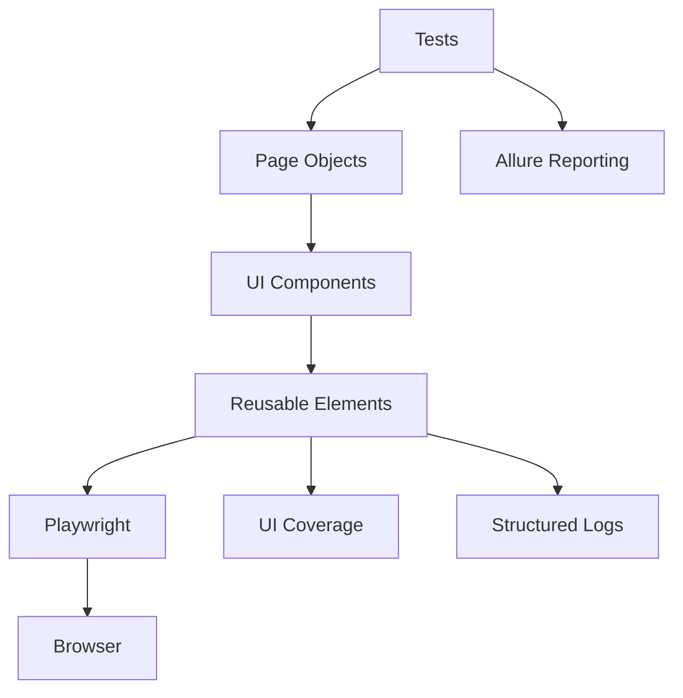

# UI Test Automation Framework

[](https://github.com/Barbaron86/autotest-ui/actions/workflows/ci.yml)


UI test automation framework for the
[UI Course Test Application](https://nikita-filonov.github.io/qa-automation-engineer-ui-course/#/auth/login).

The project is built around a layered UI automation architecture and uses:

- 🐍 **Python 3.12** — framework and test implementation
- 🎭 **Playwright** — browser automation and cross-browser execution
- 🧪 **pytest** — test runner, fixtures and test parametrization
- ⚡ **pytest-xdist** — parallel test execution
- 📊 **Allure** — test reporting, history and attachments
- 🧩 **Pydantic Settings** — typed and validated configuration
- 📝 **Loguru** — structured logging across the test framework
- 🔍 **mypy** — static type checking
- 🧹 **Ruff** — linting and formatting
- 📦 **Poetry** — dependency and virtual environment management
- 📈 **UI Coverage Tool** — tracking UI interactions performed by tests
- 🔄 **GitHub Actions** — automated quality checks, test execution and report publication
- 🤖 **AI-assisted review** — optional quality layer for pull requests

The tested application is maintained in a separate repository:
[qa-automation-engineer-ui-course](https://github.com/Nikita-Filonov/qa-automation-engineer-ui-course).

### 🔗 Live Reports

[Allure Report](https://barbaron86.github.io/autotest-ui/main/) ·
[UI Coverage](https://barbaron86.github.io/autotest-ui/ui-coverage/coverage.html) ·
[GitHub Actions](https://github.com/Barbaron86/autotest-ui/actions)

## 🚀 Key Features

- Cross-browser testing in **Chromium**, **Firefox** and **WebKit**
- Parallel test execution with **pytest-xdist**
- Layered architecture: **Tests → Pages → Components → Elements**
- Reusable UI elements based on stable `data-testid` locators
- Typed environment configuration with **Pydantic Settings**
- Reusable authenticated browser state stored in memory
- **Allure** reporting with test history
- Playwright **trace** and **video** artifacts
- Structured logging across the test framework with **Loguru**
- UI interaction coverage with **UI Coverage Tool**
- Static type checking with **mypy**
- Linting and formatting with **Ruff**
- Dependency and virtual environment management with **Poetry**
- CI/CD with **GitHub Actions**
- Optional **AI-assisted code review** workflow for pull requests
- Automated publication of Allure and UI Coverage reports through **GitHub Pages**

## 🏗 Architecture



Tests describe user scenarios at a high level, while browser interaction details
are encapsulated in reusable page, component and element abstractions.

The element layer provides a common interface for interacting with UI elements,
centralizing locator handling, logging, Allure steps and UI interaction coverage.

## 📁 Project Structure

```text
autotest-ui/
├── components/          # Reusable UI components
├── elements/            # Low-level UI element abstractions
├── fixtures/            # pytest fixtures
├── pages/               # Page Objects
├── testdata/            # Test files and assets
├── tests/
│   ├── authentication/  # Registration and authorization tests
│   ├── courses/         # Course management tests
│   ├── dashboard/       # Dashboard tests
│   └── infrastructure/  # Test framework infrastructure tests
├── tools/               # Playwright, Allure and framework utilities
├── .github/
│   └── workflows/       # GitHub Actions workflows
├── config.py            # Typed project configuration
├── conftest.py          # pytest configuration and plugins
├── pyproject.toml       # Dependencies and tool configuration
└── poetry.lock          # Locked dependency versions
```

## ⚙️ Getting Started

### Requirements

- Python 3.12+
- Poetry
- Allure Commandline — only required to view Allure reports locally

### Clone the Repository

```bash
git clone https://github.com/Barbaron86/autotest-ui.git
cd autotest-ui
```

### Configure Environment

Create a local `.env` file from the provided example.

Linux / macOS:

```bash
cp .env.example .env
```

Windows PowerShell:

```powershell
Copy-Item .env.example .env
```

The `.env` file contains the application URL, browser configuration,
test-user credentials and UI Coverage settings.

### Install Dependencies

Poetry manages both the virtual environment and project dependencies:

```bash
poetry install --no-root
```

### Install Playwright Browsers

```bash
poetry run python -m playwright install chromium firefox webkit
```

## 🧪 Running Tests

Run the complete regression suite:

```bash
poetry run pytest tests -m regression
```

Run regression tests in parallel:

```bash
poetry run pytest tests -m regression --numprocesses auto
```

Run tests for a specific functional area:

```bash
poetry run pytest tests -m authorization
poetry run pytest tests -m registration
poetry run pytest tests -m courses
poetry run pytest tests -m dashboard
```

## 📊 Reports

### Allure

Generate Allure results:

```bash
poetry run pytest tests -m regression --alluredir=allure-results --clean-alluredir
```

Open the report locally:

```bash
allure serve allure-results
```

The CI pipeline preserves Allure history between runs, allowing test execution
results to be tracked over time.

### UI Coverage

The framework tracks UI interactions performed through the element layer
and includes them in a dedicated coverage report.

Generate the report locally after running the tests:

```bash
poetry run ui-coverage-tool save-report
```

The CI pipeline preserves coverage history to track changes between runs.

## 🔍 Code Quality

Run Ruff linting:

```bash
poetry run ruff check .
```

Check formatting:

```bash
poetry run ruff format --check .
```

Run static type checking:

```bash
poetry run mypy .
```

The project uses strict mypy configuration for framework code while keeping
test-specific typing requirements practical.

## 🔄 CI/CD

GitHub Actions automatically runs quality checks and the regression test suite
for pushes to `main` and pull requests targeting `main`.

The pipeline performs the following stages:

```text
Poetry lock validation
        ↓
Ruff formatting check
        ↓
Ruff linting
        ↓
mypy type checking
        ↓
Playwright browser installation
        ↓
Parallel regression tests
        ↓
UI Coverage generation
        ↓
Allure report generation
        ↓
GitHub Pages publication
```

Regression tests are executed across the configured Playwright browsers using
parallel pytest workers.

Pushes to `main` publish both the Allure and UI Coverage reports to GitHub Pages.
Pull request runs publish a dedicated Allure report; UI Coverage is uploaded
as a workflow artifact when regression tests pass.

An additional manually triggered AI-assisted review workflow is available for
pull requests to provide an extra layer of code review alongside the standard CI checks.

## 🧠 Design Decisions

- **Layered UI architecture**  
  Tests operate on high-level Page Objects and components instead of directly
  interacting with Playwright locators.

- **Reusable element abstractions**  
  Common actions and assertions are centralized in the element layer to reduce
  duplication and keep test scenarios readable.

- **Stable locator strategy**  
  `data-testid` attributes are used as the primary locator contract between
  the application UI and the automation framework.

- **Typed configuration**  
  Environment settings and test data are validated through Pydantic instead of
  being accessed through unvalidated environment variables.

- **In-memory authentication state**  
  Playwright `StorageState` is created at session scope and passed directly to
  authenticated browser contexts without storing authentication data in a local JSON file.

- **Parallel execution**  
  `pytest-xdist` is used to reduce regression execution time. Each worker runs
  in its own process and manages its own session-scoped test state.

- **Centralized diagnostics**  
  Tracing, video recording, structured logging and Allure integration are handled
  by framework infrastructure rather than individual tests.

- **Quality checks before test execution**  
  Formatting, linting and static typing are validated in CI before regression
  tests are executed.

- **AI-assisted review as an optional quality layer**  
  AI review is kept separate from mandatory CI checks, so test execution, linting
  and static analysis remain deterministic and do not depend on an external AI service.